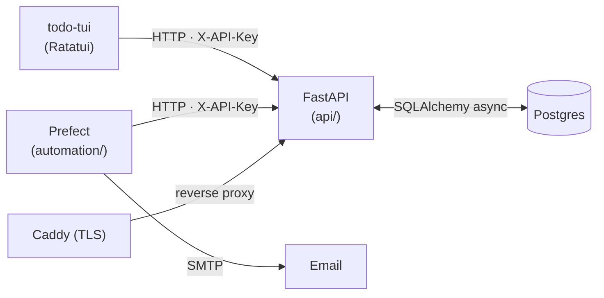

# todo

Personal todo/notes system with a terminal UI, centralized API, and email automation.

## Components

| Component | Location | Role |
|---|---|---|
| `todo-tui` | `crates/todo-tui` | Ratatui terminal UI |
| `todo-api-client` | `crates/todo-api-client` | Blocking HTTP client used by the TUI |
| `todo-store` | `crates/todo-store` | Shared DTO types (Todo, Note, Event, Context) |
| `todo-mailer` | `crates/todo-mailer` | Rust email helper library |
| FastAPI service | `api/` | REST backend, Postgres via SQLAlchemy 2.x async |
| Prefect automation | `automation/` | Scheduled daily snapshot email via SMTP |
| Postgres | Docker volume `pgdata` | Single source of truth |

## Architecture



## How they connect

- The TUI reads config from `~/.config/todo-tui/config.toml` or env vars and talks to the API over HTTP.
- All mutations go through the API; the TUI caches the last fetched lists locally in memory.
- The Prefect automation runs on a cron schedule (weekdays 08:00 UTC) and sends an HTML snapshot email grouped by context.
- Events (create/rename/toggle/delete) are appended to an `events` table in the same transaction as the mutation — the TUI's `:history` view reads them via `GET /events`.

## Authentication

API requests are authenticated with a static `X-API-Key` header. The key is hashed (SHA-256 lookup + argon2 verify) and stored in the `api_keys` table — the plaintext is never persisted.

The bootstrap key is generated once on first startup and printed to the API log. Set `BOOTSTRAP_API_KEY` in `.env` before first start to pin a known value.

For outbound email (snapshot), configure SMTP credentials in `.env` (`TODO_SMTP_USER`, `TODO_SMTP_PASS`). Gmail app passwords work out of the box with the default `smtp.gmail.com:587` settings.

## Setup

### Prerequisites

- Docker + Docker Compose
- Rust toolchain (`rustup`)
- Python 3.12 + `uv`
- `just` (`cargo install just` or `curl -LsSf https://just.systems/install.sh | bash -s -- --to ~/.local/bin`)

### First run (local development)

```bash
# 1. copy and edit secrets
cp deploy/.env.example .env   # fill in at minimum BOOTSTRAP_API_KEY and SMTP credentials

# 2. start Postgres + API (creates schema and seeds bootstrap user on first boot)
just stack-up

# 3. build and install the TUI
just build

# 4. load env and launch
source .env && todo-tui
```

### Remote deployment

The production stack runs on a VPS behind Caddy (automatic TLS). Docker Compose merges `docker-compose.yml` with `docker-compose.prod.yml` — the prod override removes host-exposed ports, enables `restart: unless-stopped`, and adds the Caddy service.

**One-time server preparation** (run as root on the VPS):

```bash
bash deploy/setup-server.sh
```

This installs Docker, enables UFW with rules for SSH / 80 / 443 (including HTTP/3 QUIC), and creates `/srv/todo`.

**Deploy and start**:

```bash
# 1. push secrets to the server (do this before first deploy)
just deploy-env SERVER=user@host

# 2. rsync code to the server
just deploy SERVER=user@host

# 3. build images and start the full stack on the server
just stack-up-prod SERVER=user@host

# 4. verify the remote API
just ping-remote SERVER=user@host

# 5. open the Prefect UI via SSH tunnel (optional)
just prefect-ui SERVER=user@host
```

`SERVER` can also be set in `.env` so you can omit it from every command.

## Common commands

```bash
# Docker / stack
just stack-up          # start Postgres + API
just stack-down        # stop everything
just automation-up     # start the Prefect automation container
just automation-logs   # tail automation logs

# Development
just api-dev           # local uvicorn with SQLite (no Docker needed)
just tui               # run TUI from source (loads .env automatically)

# Quality checks
just rs-qc             # rustfmt + clippy (Rust)
just py-qc             # ruff format/lint + ty typecheck (Python)

# Tests
just test-rust         # cargo test --workspace
just test-api          # pytest

# Remote
just deploy            # rsync code to server
just deploy-env        # push .env to server
just stack-up-prod     # build + start full prod stack on server
just ping-remote       # health-check the remote API
just ssh-remote        # open SSH shell on server
just automation-run    # trigger snapshot email manually on server
just prefect-ui        # open Prefect UI via SSH tunnel
```
